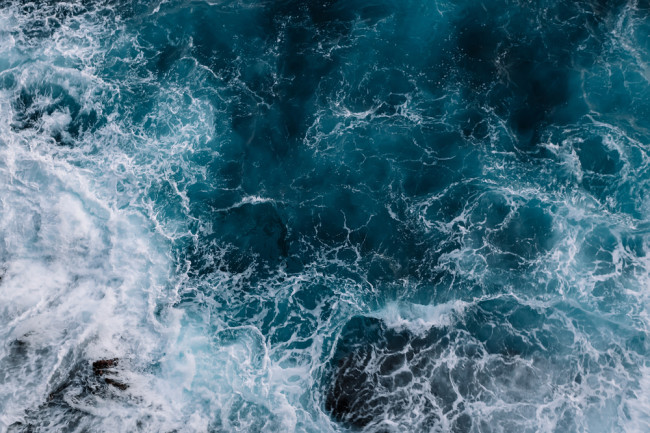
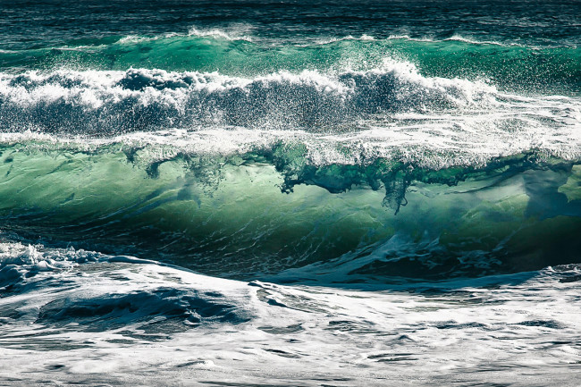

# Ocean

The ocean is a huge body of saltwater that covers about 71 percent of the Earth’s surface. The planet has one global ocean, though oceanographers and the nations of the world have divided it into distinct geographic regions: the Pacific, Atlantic, Indian, and Arctic oceans. In recent years, some oceanographers have determined that the seas around Antarctica deserve their own designation: the Southern Ocean.

### Ocean Waves

Though the oceans cover more than 70 percent of Earth, only 20 percent is visible to us. So we are usually only able to see the water at the surface, not most of it, the other 80 percent, below.

The ocean is a huge body of saltwater that covers about 71 percent of the Earth’s surface. The planet has one global ocean, though oceanographers and the nations of the world have divided it into distinct geographic regions: the Pacific, Atlantic, Indian, and Arctic oceans. In recent years, some oceanographers have determined that the seas around Antarctica deserve their own designation: the Southern Ocean.

An estimated 97 percent of the world’s water is found in the ocean. Because of this, the ocean has considerable impact on weather, temperature, and the food supply of humans and other organisms. Despite its size and impact on the lives of every organism on Earth, the ocean remains a mystery. More than 80 percent of the ocean has never been mapped, explored, or even seen by humans. A far greater percentage of the surfaces of the moon and the planet Mars have been mapped and studied than our own ocean floor has.

Although there is much more to learn, oceanographers have already made some amazing discoveries. For example, we know that the ocean contains towering mountain ranges and deep canyons, known as trenches, just like those on land. The peak of the world’s tallest mountain—Mount Everest in the Himalayas, measuring 8.84 kilometers (5.49 miles) high—would not even break the surface of the water if it was placed in the Pacific Ocean’s Mariana Trench or Philippine Trench, two of the deepest parts of the ocean.

On the other hand, the Atlantic Ocean is relatively shallow because large parts of its seafloor are made up of continental shelves—parts of the continents that extend far out into the ocean. The average depth of the entire ocean is 3,720 meters (12,200 feet).

It is unknown how many different species call the ocean their home. With many marine ecosystems suffering from rising sea temperatures, pollution, and other problems, some oceanographers believe the number of species is dropping. Still, there may be many positive surprises awaiting oceanographers in the years ahead. It could be that more than 90 percent of the ocean’s species are still undiscovered, with some scientists estimating that there are anywhere between a few hundred thousand to a few million more to be discovered. Currently, scientists know of around 226,000 ocean species. 
![Branching]
